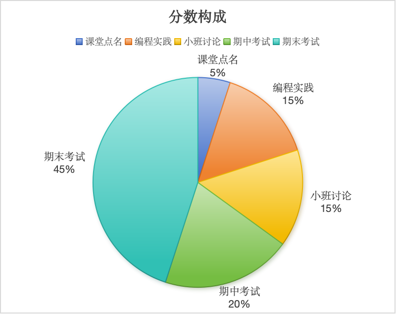

# 算法设计与分析

## 课程简介

### 课程概述

计算机算法作为计算机解决实际问题的主要手段，是大数据等专业学生需要掌握的核心技能之一。算法设计与分析课程在数据结构课程的基础上，进一步剖析各类主要算法的问题描述、主要思想、基本原理和应用场景，使得学生不仅能掌握当前主要算法技术的工作原理，而且能理解该算法产生的背景和设计理念，使其能灵活运用这些技术，结合实际情况设计合适的算法解决问题。

### 课程基本信息

| 开课单位 | 计算机学院 | 课程代码 | ZH110XK24 |
| --- | --- | --- | --- |
| 课程名称 | 算法设计与分析 | 英文名称 | Algorithm Design and Analysis |
| 课程性质 | 专业核心课程 | 学分 | 4.0 |
| 总学时 | 48 | 先修课程 | 数据结构与算法 |
| 开课学期 | 秋季学期 | 适应专业 | 大数据、生物+计科双学位、国贸+大数据双学位 |

### 评分规则
课程最终成绩由五部分组成：

### 时间地点

| 班级 | 上课地点 | 上课时间 |
| --- | --- | --- |
| 国贸+大数据双学位2501班、生物+计科双学位2501班、大数据[2501-2502]班 | 湖南大学 南校区 综202 | 1-16周：星期一5-6节(14:30-16:00) 2,4,6,8,10,12,14,16周：星期四7-8节(16:10-17:40) |
| 大数据2501班小班讨论 | 湖南大学 南校区 研A108 | 5,7,11,15周：星期一3-4节(10:00-11:40) |
| 国贸+大数据双学位2501班讨论 | 湖南大学 南校区 综308 | 5,7,11,15周：星期一7-8节(16:10-17:40) |
| 大数据2502班小班讨论 | 湖南大学 南校区 综308 | 5,7,11,15周：星期三1-2节、3-4节(10:00-11:40) |
| 生物+计科双学位2501班小班讨论 | 湖南大学 南校区 研A106 | 5,7,11,15周：星期四7-8节(16:10-17:40) |

## 教师简介

彭鹏，湖南大学计算机学院副教授、软件工程系党支部书记，湖南省芙蓉计划科技创新人才。2009年获北京师范大学信息科学与技术学院学士学位，2016年获北京大学王选计算机研究所博士学位（师从赵东岩、邹磊教授）。曾于2014年赴香港科技大学计算机科学与工程系担任访问学者，与陈雷教授开展合作研究；2020年赴加拿大滑铁卢大学David R. Cheriton计算机科学学院数据系统研究小组访学，与M. Tamer Özsu教授进行学术交流。 主要研究领域为大规模知识库系统的性能优化与安全性检测，已在数据库领域顶级期刊和会议上发表多篇高水平学术论文，包括 VLDB Journal、SIGMOD、ICDE、KDD、TKDE 等 CCF A类 刊物。

详情见[个人主页]([ppt/1.pdf](https://bnu05pp.github.io/index.html))

## 教学教材

### 算法导论·核心篇（原书第4版）

作者：[美]托马斯·H. 科尔曼(Thomas H. Cormen),[美]查尔斯·E. 雷瑟尔森(Charles E. Leiserson),[美]罗纳德·L. 李维斯特(Ronald L. Rivest),[美]克利福德·斯坦(Clifford Stein)

《算法导论（原书第4版）》以高度的严谨性与全面的覆盖性著称，深入阐述计算机算法设计与分析的各个重要领域。从排序和顺序统计量、数据结构、图算法等经典内容，到动态规划、贪心算法、摊还算法等高级设计和分析技术，再到NP完全性理论与近似算法等前沿课题，全书体系完整，条理清晰。各章自成体系，均可作为独立的学习单元；算法以伪代码形式呈现，说明与解释力求深入浅出而不失数学严谨性，具备基础程序设计经验的读者即可理解。本书适合计算机及相关专业本科生、研究生作为教材使用，亦是软件工程师、算法工程师、数据科学家、研究人员，以及所有希望夯实算法基础、提升编程内功的开发人员案头必备的参考书。本书是《算法导论（原书第4版）》的核心篇（第1~25章），涉及算法设计与分析的核心理论及应用。

## 教学课件
第一讲、算法设计与分析基础
课件查看请点击：[课件1](ppt/1.pdf)

第二讲、高级数据结构
课件查看请点击：[课件2](ppt/2.pdf)

第三讲、摊还分析
课件查看请点击：[课件3](ppt/3.pdf)

第四讲、排序
课件查看请点击：[课件4](ppt/4.pdf)

第五讲、树
课件查看请点击：[课件5](ppt/5.pdf)

第六讲、扩张的数据结构
课件查看请点击：[课件6](ppt/6.pdf)

第七讲、分治
课件查看请点击：[课件7](ppt/7.pdf)

第八讲、动态规划
课件查看请点击：[课件8](ppt/8.pdf)

第九讲、贪心算法
课件查看请点击：[课件9](ppt/9.pdf)

第十讲、基本图算法
课件查看请点击：[课件10](ppt/10.pdf)

第十一讲、最小生成树
课件查看请点击：[课件11](ppt/11.pdf)

第十二讲、单源最短路径
课件查看请点击：[课件12](ppt/12.pdf)

第十三讲、所有点对间最短路径
课件查看请点击：[课件13](ppt/13.pdf)

第十四讲、图算法前沿
课件查看请点击：[课件14](ppt/14.pdf)

第十五讲、回溯与分支限界
课件查看请点击：[课件15](ppt/15.pdf)

第十六讲、计算复杂度理论
课件查看请点击：[课件16](ppt/16.pdf)

## 平时成绩

### 编程实践：Leetcode截屏考核说明

LEETCODE截图示例

每周五8:00到24:00，将自己Leetcode截屏发给我学生邮箱3318965636@qq.com，邮件标题格式为“Leetcode截屏-[姓名]-[学号]-[日期]”；

每周要求至少做3道题目，题目范围参照课程进度；

一个难度简单的题，计2分；一个难度中等的题，计3分；一个难度困难的题，计4分。单次分数上限10分。

### 小班讨论
小班讨论总分为100分，其中算法分析演讲60分，提交算法分析报告40分（发给我学生邮箱3318965636@qq.com）。每班分6组，5~6人一组。

需要完成的任务要求如下：
每组需要运行代码，制作PPT讲解代码，分析每个程序的时间复杂度，程序的瓶颈及改进方式，每一组至少要安排2个不同的两个人进行讲解。

1、演讲分数（60分）

（1）代码运行及解读完整度（15分）：运行成功得5分，讲解出现一个错误扣1分。

（2）时间复杂度分析（15分）。有进行时间复杂度分析就给分。

（3）程序瓶颈分析及程序改进方法的效果（10分）。瓶颈分析正确得5分，提出有效的改进方法得5分。

（4）PPT制作水平（10分）：版面设计和谐美观，布局合理，导航清晰简洁，幻灯片之间有层次性和连贯性，逻辑顺畅，过渡恰当：3分；文字清晰，字体设计恰当、色彩搭配配合合理协调，风格统一，视觉效果好，符合视觉心理：3分；合理使用PPT动画等新功能：2分；具有鲜明个性，创意新颖：2分

（5）演讲水平10分。要求衣着整洁，仪态大方、举止自然得体，体现朝气蓬勃的精神面貌，上下场致意：2分；要求脱稿演讲，声音洪亮，口齿清晰，普通话标准，语速适当、表达流畅，讲究演讲技巧，动作恰当：5分；综合印象：由评委根据演讲选手的临场表现及现场感染力作出综合评价：3分

2、提交算法分析报告（40分）

包括算法分析完整性10分、报告完整性10分、文档规范10分、实验结果10分。

报告完整性包括算法分析，算法实现，时间复杂度分析，心得等等。

## 课程大纲

### 课程教学目标
1.通过对常用的、有代表性的算法的研究，让学生理解并掌握算法设计的基本技术。

2.培养学生分析算法复杂度的初步能力，锻炼其逻辑思维能力和想象力，并使之了解算法理论的发展。

3.鼓励学生运用算法知识解决各自学科的实际问题，培养他们的独立科研的能力和理论联系实践的能力。

### 基本教学内容
#### 第一讲、算法设计与分析基础

__教学目的与要求：__ 介绍算法设计与分析的基本概念，奠定学生对课程的理论基础；使学生了解本课程评分方法。

__教学重点：__ 算法设计与分析的基本概念。

__教学难点：__ 评分方法。

__教学内容：__ 1、背景介绍；2、算法基本概念；3、算法与数据结构、程序的关系；4、重要问题类型；5、算法时间复杂度分析；6、一个算法例子：文本距离。

__教学思政元素：__ 强调算法的重要性，培养学生的创新精神和批判性思维能力。

#### 第二讲、高级数据结构

__教学目的与要求：__ 介绍后续课程中会用到的高阶数据结构——堆和散列表，使学生理解其基本原理和应用场景。

__教学重点：__ 堆的基本概念与性质、散列表的原理与应用。

__教学难点：__ 堆的实现和操作、散列表的冲突解决。

__教学内容：__ 1、堆；2、散列表。

__教学思政元素：__ 通过介绍各种数据结构，培养学生的系统思维和问题解决能力。

#### 第三讲、摊还分析

__教学目的与要求：__ 引导学生理解摊还分析的概念和重要性；学会使用哈希表例子介绍摊还分析的基本原理；掌握摊还分析的三种方法，包括聚合分析、势能法和记账法；培养学生在设计和分析算法时考虑平均性能的能力。

__教学重点：__ 哈希表例子引入、摊还分析的基本概念、摊还分析的三种方法。

__教学难点：__ 摊还分析的思维转变、势能法的理解。

__教学内容：__ 1、哈希表例子引入；2、摊还分析的基本概念；3、摊还分析的三种方法：聚合分析、势能法和记账法。

__教学思政元素：__ 通过摊还分析的介绍，培养学生的优化和成本效益思维。

#### 第四讲、排序

__教学目的与要求：__ 介绍常见的排序算法，使学生了解它们的基本原理、优势和不足；引导学生使用递归树来理解排序算法的时间复杂度，以及通过决策树来判断基于比较的排序算法的下界。

__教学重点：__ 插入排序、归并排序、快速排序、计数排序、基数排序；递归树；决策树。

__教学难点：__ 递归树的应用、决策树的理解。

__教学内容：__ 1、插入排序、归并排序、快速排序；2、递归树的应用；3、决策树与排序算法下界；4、计数排序、基数排序。

__教学思政元素：__ 通过研究排序算法，培养学生的效率和优化意识。

#### 第五讲、树

__教学目的与要求：__ 介绍二叉搜索树、AVL树和红黑树等树结构，使学生了解不同类型的树结构及其在数据存储和搜索中的应用。

__教学重点：__ 二叉搜索树、AVL树和红黑树。

__教学难点：__ AVL树和红黑树的平衡条件、平衡树中进行的旋转操作。

__教学内容：__ 1、二叉搜索树；2、AVL树；3、红黑树；4、其他树结构。

__教学思政元素：__ 通过研究树的结构，培养学生的层次和结构化思维。

#### 第六讲、扩张的数据结构

__教学目的与要求：__ 引导学生深入了解扩张的数据结构，包括动态顺序统计、扩张数据结构的概念和区间树。

__教学重点：__ 动态顺序统计、如何扩张数据结构、区间树。

__教学难点：__ 动态顺序统计的实现。

__教学内容：__ 1、动态顺序统计；2、如何扩张数据结构；3、区间树。

__教学思政元素：__ 通过扩张的数据结构的介绍，培养学生的适应和创新能力。

#### 第七讲、分治

__教学目的与要求：__ 介绍分治法的基本思想，使学生能够理解和应用分治法解决问题；引导学生学会使用递归式分析算法的时间复杂度，同时了解主定理的应用。

__教学重点：__ 分治法的设计思想、分治法的典型问题、递归式与主定理。

__教学难点：__ 分治法的抽象思维、递归式求解与主定理应用。

__教学内容：__ 1、分治法的基本思想与设计步骤；2、最大子段和问题；3、递归式与主定理；4、矩阵乘法与最近点对问题5、求峰值的问题。

__教学思政元素：__ 通过分治法的介绍，培养学生的合作和团队精神。

#### 第八讲、动态规划

__教学目的与要求：__ 介绍动态规划法的基本设计思想，使学生能够理解并应用该思想解决问题；引导学生了解动态规划法在具体问题中的应用，特别是在涉及子问题重叠的情况下的优势。

__教学重点：__ 动态规划法的设计思想、子问题重叠的问题举例、动态规划法解决典型问题。

__教学难点：__ 动态规划的设计思想、子问题重叠的优化。

__教学内容：__ 1、动态规划法的基本思想与设计步骤；2、子问题重叠的问题举例：三角数塔问题；3、最大子段和问题；4、最长公共子序列问题；5、0-1背包问题；6、矩阵乘法问题。

__教学思政元素：__ 通过动态规划的介绍，培养学生的长期规划和战略思维。

#### 第九讲、贪心算法

__教学目的与要求：__ 介绍贪心算法的基本概念和原理，使学生能够理解并应用贪心算法解决问题；引导学生了解贪心算法在不同问题中的应用，特别关注活动选择问题、哈夫曼编码、背包
问题等。

__教学重点：__ 贪心算法的基本概念、贪心算法的应用、贪心算法与人工智能算法。

__教学难点：__ 贪心算法的设计思想、贪心算法的适用条件。

__教学内容：__ 1、贪心算法的基本概念与原理；2、活动选择问题；3、哈夫曼编码；4、背包问题；5、多机调度问题；6、最小延迟调度问题；7、找零问题；8、贪心算法与人工智能算
法。

__教学思政元素：__ 通过贪心的介绍，培养学生的决策和优先级设置能力。

#### 第十讲、基本图算法

__教学目的与要求：__ 介绍图的基本概念，使学生了解图的基本结构与术语；引导学生学习图的遍历算法，包括广度优先搜索和深度优先搜索；培养学生对图算法的理解和实际应用能力。

__教学重点：__ 图的基本概念、广度优先搜索（BFS）、深度优先搜索（DFS）。

__教学难点：__ 图的抽象概念理解、深度优先搜索的递归实现。

__教学内容：__ 1、图的基本概念；2、广度优先搜索（BFS）；3、深度优先搜索（DFS）。

__教学思政元素：__ 通过图的介绍，培养学生的网络和连接思维。

#### 第十一讲、最小生成树

__教学目的与要求：__ 介绍最小生成树的概念，使学生理解最小生成树在图论中的应用；引导学生学习两种经典的最小生成树算法：Prim算法和Kruskal算法；培养学生分析和比较不同算
法的能力，以及并查集在Kruskal算法中的应用。

__教学重点：__ 最小生成树的生成、Prim算法(普里姆)、Kruskal算法(克鲁斯卡尔)、并查集。

__教学难点：__ 并查集的理解与应用。

__教学内容：__ 1、最小生成树的生成；2、Prim算法（普里姆）；3、Kruskal算法（克鲁斯卡尔）；4、Prim算法和Kruskal算法的对比分析；5、并查集的应用。

__教学思政元素：__ 通过最小生成树的介绍，培养学生的优化和成本效益思维。

#### 第十二讲、单源最短路径

__教学目的与要求：__ 介绍单源最短路径问题，使学生理解在图中找到从单个源点到其他所有点的最短路径的问题；引导学生学习经典的单源最短路径算法：松弛算法、有向无环图上的最短
路径计算、Dijkstra算法、Bellman-Ford算法；探讨最短路径问题在实际应用中的扩展。

__教学重点：__ 松弛算法、有向无环图上的最短路径计算、Dijkstra算法、Bellman-Ford算法。

__教学难点：__ 松弛操作的理解。

__教学内容：__ 1、最短路径问题；2、松弛算法；3、有向无环图上的最短路径计算；4、Dijkstra算法；5、Bellman-Ford算法；6、差分约束和最短路径；7、最短路径问题扩展应用。

__教学思政元素：__ 通过最短路径的介绍，培养学生的优化和最短路径思维。

#### 第十三讲、所有点对间最短路径

__教学目的与要求：__ 介绍所有点对间最短路径问题，使学生了解在图中找到所有节点对之间的最短路径的问题；引导学生学习两种经典的所有点对间最短路径算法：Floyd-Warshall算法
和Johnson算法。

__教学重点：__ Floyd-Warshall算法和Johnson算法。

__教学难点：__ Floyd-Warshall算法和Johnson算法的理解。

__教学内容：__ 1、所有点对间的最短路径问题；2、Floyd-Warshall算法；3、Johnson算法。

__教学思政元素：__ 通过所有点对间最短路径的介绍，培养学生的全局和全面思维。

#### 第十四讲、图算法前沿

__教学目的与要求：__ 引导学生了解图算法在一些前沿领域的应用，包括链接分析、社区发现和知识图谱；探讨这些应用在实际场景中的意义和挑战。

__教学重点：__ 链接分析、社区发现和知识图谱。

__教学难点：__ 前沿应用的复杂性、算法与实际问题的结合。

__教学内容：__ 1、链接分析；2、社区发现；3、知识图谱。

__教学思政元素：__ 通过图算法前沿的介绍，培养学生的创新和探索精神。

#### 第十五讲、回溯与分支限界

__教学目的与要求：__ 引导学生深入了解回溯与分支限界算法的原理；学会应用回溯与分支限界算法解决实际问题，如批任务处理问题、0-1背包问题和频繁项集挖掘；掌握如何分析问题，
确定问题的状态空间，设计回溯或分支限界算法。

__教学重点：__ 回溯与分支限界原理，批任务处理问题、0-1背包问题和频繁项集挖掘。

__教学难点：__ 回溯与分支限界算法的理解、问题状态空间的确定。

__教学内容：__ 1、回溯与分支限界原理；2、批任务处理问题；3、0-1背包问题；4、数据挖掘经典问题——频繁项集挖掘为例。

__教学思政元素：__ 通过回溯与分支限界的介绍，培养学生的尝试和探索精神。

#### 第十六讲、计算复杂度理论

__教学目的与要求：__ 引导学生了解计算复杂度理论的基本概念，包括图灵机、计算复杂性理论和NP完全问题；理解计算问题的可计算性和复杂度；掌握常见的NP完全问题，了解其背后的理
论基础。

__教学重点：__ 图灵机的思想与模型简介、计算复杂性理论简介、常见NP完全问题。

__教学难点：__ 图灵机的抽象概念、复杂性理论的抽象概念、NP完全问题的理解。

__教学内容：__ 1、图灵机的思想与模型简介；2、计算复杂性理论简介；3、常见NP完全问题。

__教学思政元素：__ 通过计算复杂度理论的介绍，培养学生的抽象和理论思维能力。

## 教学进程

## 试卷样例

## 习题与解答

## 特色资源

电子版题集：https://www.matiji.net/exam/baiduzhixing

## 其他资源

1、题集图书：《百度之星题集2005-2021年》，清华大学出版社2022年版http://www.tup.tsinghua.edu.cn/bookscenter/book_09491901.html

2、教材课后题答案：https://walkccc.me/CLRS/
